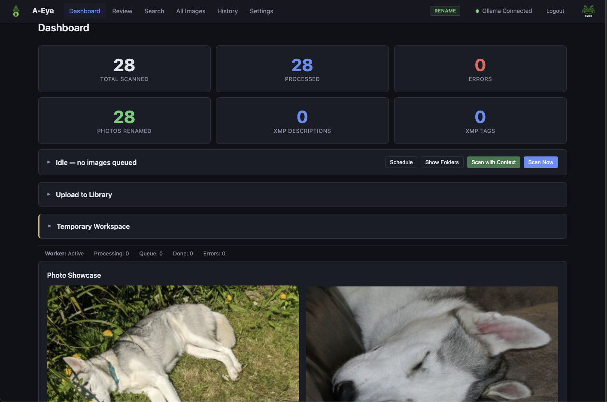
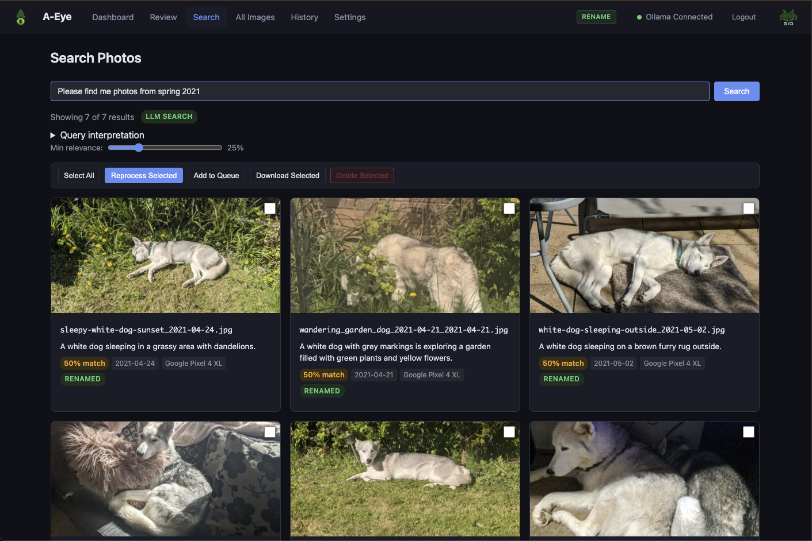
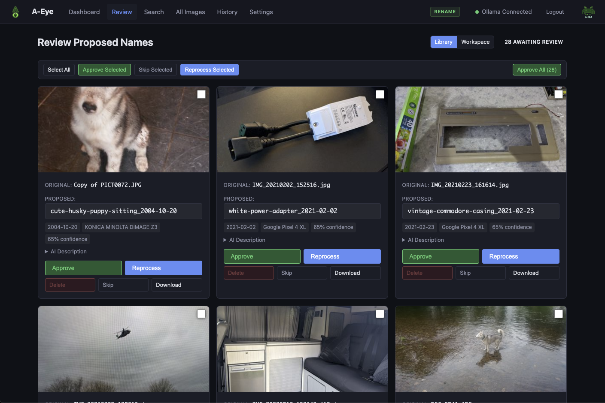
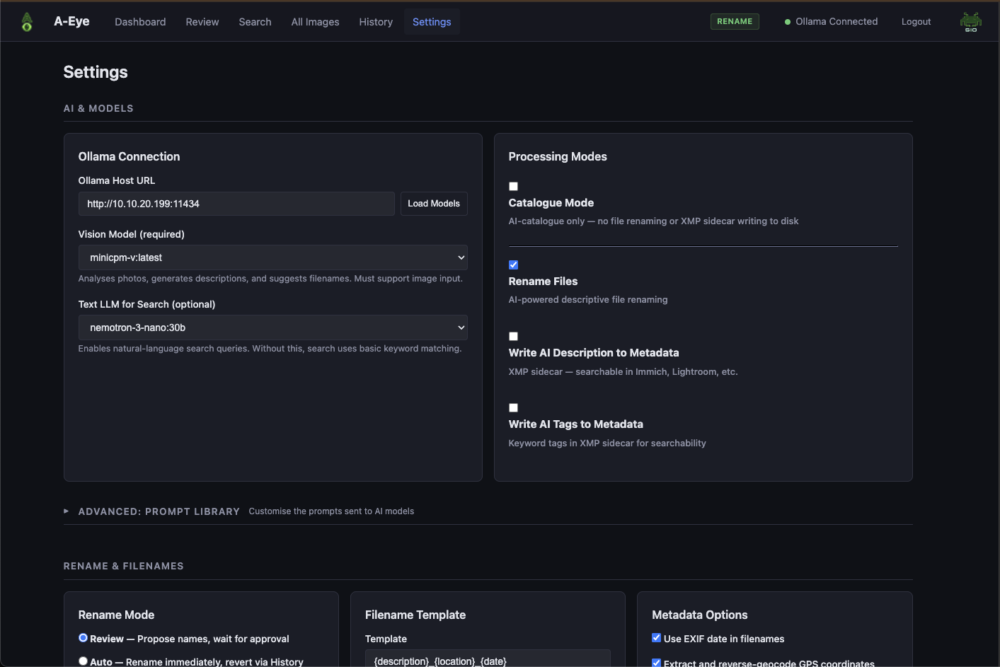

<p align="center">
  
</p>

<h1 align="center">A-Eye</h1>

<p align="center">
  <strong>A self-hosted AI photo intelligence tool.</strong><br>
  Uses local vision models to understand, describe, tag, rename, and search your photos — no cloud needed, everything runs on your own hardware.
</p>

<p align="center">
  
  
</p>
<p align="center">
  
  
</p>

---

## Features

- **AI-powered descriptions and filenames** — a local vision model looks at each photo and generates a meaningful description and filename based on what it actually sees
- **Natural language photo search** — find photos by describing what you're looking for ("sunset over the ocean", "the kids playing in the garden"). Uses an optional text LLM to expand your search query into smart keyword matches
- **XMP sidecar writing** — descriptions, tags, and dates are written to .xmp sidecar files, compatible with Immich, Lightroom, digiKam, and other photo tools
- **Quality detection** — flags blurry, overexposed, underexposed, and accidental photos (pocket shots, finger-over-lens, etc.) so you can find and clean up the duds
- **Processing context** — provide context for batches of photos to improve AI accuracy (e.g. "holiday to Crete 2021", "the dog is named Shadow", "this is a wedding reception")
- **Date extraction** — when photos are missing EXIF date data, A-Eye extracts dates from the AI description and visible clues in the image
- **Temporary workspace** — upload photos from any device, process them with AI, review the results, and download a zip. Great for triaging screenshots, phone dumps, or photos from someone else
- **Catalogue-only mode** — mount your photos read-only and A-Eye automatically switches to non-destructive mode. All the AI analysis without touching your files
- **Customisable AI prompts** — full prompt template editor with AI-assisted prompt creation. Tweak exactly what the vision model looks for and how it responds
- **Database backup and restore** — one-click backup with library verification to check for missing or moved files. Restore from any previous backup
- **Photo queue** — collect photos from across different pages and process them as a batch
- **Destructive mode safety toggle** — delete and trash operations are locked behind a toggle that must be explicitly enabled in Settings, with confirmation dialogs on top
- **Scheduled processing** — set a daily time window for processing (e.g. overnight) so A-Eye doesn't compete with other workloads during the day
- **Dashboard photo showcase** — a crossfading photo showcase with Ken Burns effect, filterable by tag. Includes a fullscreen mosaic mode
- **Watch mode** — OS-level filesystem monitoring that automatically detects and processes new photos as they appear
- **Folder exclusion** — exclude specific subdirectories from processing via a visual tree browser

## Requirements

- **Docker** (or Unraid with Community Applications)
- **[Ollama](https://ollama.ai)** installed and running somewhere accessible on your network

Ollama does **not** need to be on the same machine as A-Eye. It can run on:
- The same server as A-Eye
- A different machine on your local network
- A Mac with Apple Silicon (great GPU performance)
- A gaming PC or workstation with an NVIDIA GPU
- A remote machine accessible via Tailscale or VPN

As long as A-Eye can reach Ollama's URL over HTTP, it works.

## Installation — Unraid

1. Go to **Community Applications** in Unraid
2. Search for **A-Eye**
3. Click **Install** — the template has fields for:
   - **Ollama Host** — the URL of your Ollama instance
   - **Photos Directory** — path to your photo library on Unraid
   - **Web UI Port** — defaults to 8000
4. Set the **Ollama Host URL** to wherever Ollama is running (e.g. `http://192.168.1.100:11434`)
5. Set the **Photos Directory** to your photo library location (e.g. `/mnt/user/photos`)
6. Click **Apply** to start the container
7. Open the Web UI and complete the **onboarding wizard**

## Installation — Docker Compose

Clone the repo or create a `docker-compose.yml`:

```yaml
services:
  a-eye:
    image: spaceinvaderone/a-eye
    container_name: a-eye
    ports:
      - "8000:8000"
    environment:
      OLLAMA_HOST: http://YOUR-OLLAMA-IP:11434
      PUID: 1000   # Set to the UID that owns your photos directory (run: id -u)
      PGID: 1000   # Set to the GID that owns your photos directory (run: id -g)
    volumes:
      - /path/to/your/photos:/photos        # Your photo library
      - a-eye-data:/app/data                 # Database, thumbnails, config, backups, and workspace
    restart: unless-stopped

volumes:
  a-eye-data:
```

Then start it up:

```bash
docker compose up -d
```

Open `http://YOUR-SERVER-IP:8000` in your browser and complete the onboarding wizard.

### Volume Mounts

| Mount | Purpose |
|-------|---------|
| `/photos` | Your photo library. Can be read-write (for renaming) or read-only (for catalogue mode) |
| `/app/data` | Persistent storage — database, thumbnails, config file, backups, and workspace |

## Running on Mac or Windows

A-Eye runs in Docker Desktop on Mac and Windows too. Point the photos volume at a local folder — your Pictures directory, Desktop, Screenshots folder, or wherever you keep photos.

```yaml
volumes:
  - ~/Pictures:/photos
  - a-eye-data:/app/data
```

For the Ollama connection:
- If Ollama is running on the **same machine**, use `http://host.docker.internal:11434` or your machine's network IP
- If Ollama is on a **remote server**, use that server's IP address

This is a good setup for quick triage of screenshots and downloads without needing a dedicated server.

## Getting Started

After installation, the **onboarding wizard** walks you through setup:

1. **Connect to Ollama** — enter the URL of your Ollama instance and test the connection
2. **Choose hardware mode** — tell A-Eye whether you're running on GPU or CPU so it can recommend the right model
3. **Select a vision model** — pick from installed models or download the recommended one directly from the wizard
4. **Pick your photos folder** — browse and confirm which directory to process

Once onboarding is complete:

- Hit **Scan Now** on the dashboard to process your library
- Go to the **Review** page to approve or edit proposed filenames
- Use **Search** to find photos with natural language queries
- Explore **Settings** for advanced options — XMP sidecar writing, catalogue-only mode, custom prompts, scheduled processing, and more

## Connecting to Ollama

A-Eye just needs HTTP access to Ollama's API port. Here are the common setups:

### Ollama on the same Unraid server or Linux host

Use the server's IP address:

```
http://192.168.1.100:11434
```

Just the normal IP of the machine Ollama is running on. If Ollama is on the same machine as A-Eye, use that machine's IP.

### Ollama on another machine on the LAN

Same thing — use the IP of the machine running Ollama:

```
http://192.168.1.200:11434
```

**Important:** Ollama needs to be bound to `0.0.0.0` instead of `localhost` to accept remote connections:

- **Mac:** `launchctl setenv OLLAMA_HOST "0.0.0.0:11434"` then restart Ollama
- **Linux:** Set the environment variable `OLLAMA_HOST=0.0.0.0:11434` (in your systemd service or shell profile)
- **Windows:** Set the environment variable `OLLAMA_HOST=0.0.0.0:11434` in System Environment Variables

### Ollama via Tailscale

Use the Tailscale IP:

```
http://100.x.x.x:11434
```

Works from anywhere, fully encrypted, no port forwarding needed.

### Running A-Eye on Mac or Windows via Docker Desktop

If Ollama is running on the same machine, you can use:

```
http://host.docker.internal:11434
```

Or just use the machine's network IP — either works.

## Recommended Models

### Vision Model (required)

| Setup | Recommended Model | Notes |
|-------|------------------|-------|
| **GPU (8GB+ VRAM)** | `minicpm-v` | Good balance of speed and quality. The onboarding wizard can download it for you |
| **CPU only** | `llava` | Works reasonably well without GPU acceleration, but processing is significantly slower per photo |

### Text Model for Search (optional)

Any Ollama text model works for the LLM search feature. Larger models like `qwen3` or similar give richer search keyword expansion, but smaller models still work well. Set this in Settings under the LLM Model field.

You can change models at any time in Settings, and A-Eye works with any Ollama-compatible vision model.

## Security

A-Eye is designed for home lab and LAN deployments. Here's what's in place:

- **Authentication** — cookie-based sessions with HMAC-SHA256 signed tokens and constant-time credential comparison. Basic Auth fallback for API clients
- **Destructive operation gating** — all delete and trash operations require the destructive mode toggle to be enabled in Settings, enforced on the backend with 403 responses
- **Read-only auto-detection** — when the photos directory is mounted read-only, A-Eye automatically enters catalogue mode and disables all write operations
- **Path traversal protection** — all file operations use `resolve()` and `relative_to()` to ensure paths stay within allowed directories
- **Filename sanitisation** — user-provided and AI-generated filenames are stripped of directory traversal attempts, hidden file prefixes, and unsafe characters
- **Upload restrictions** — file extension whitelisting (image formats only) and configurable per-file size limits
- **SQL injection prevention** — parameterised queries throughout, with column name whitelisting as defence-in-depth
- **XSS prevention** — HTML escaping on all user-controlled content rendered in the browser
- **Non-root execution** — the Docker container drops to a non-root user after startup. PUID/PGID support lets you match container permissions to your host file ownership

If you're exposing A-Eye through a reverse proxy, use your proxy's built-in rate limiting and TLS termination.

## Configuration Reference

All settings are configurable through the web UI. They can also be set via environment variables for initial container setup — once you save settings in the UI, those values take priority.

### Connection

| Setting | Env Var | Default | Description |
|---------|---------|---------|-------------|
| Ollama Host | `OLLAMA_HOST` | `http://localhost:11434` | URL of the Ollama instance |
| Vision Model | `VISION_MODEL` | `minicpm-v` | Ollama vision model for photo analysis |
| LLM Model | `LLM_MODEL` | *(empty)* | Optional text model for natural language search |

### Authentication

| Setting | Env Var | Default | Description |
|---------|---------|---------|-------------|
| Username | `BASIC_AUTH_USER` | *(empty)* | Web UI username. Leave blank to disable auth |
| Password | `BASIC_AUTH_PASS` | *(empty)* | Web UI password |

### Paths

| Setting | Env Var | Default | Description |
|---------|---------|---------|-------------|
| Photos Directory | `PHOTOS_DIR` | `/photos` | Container path to the photo library |
| Data Directory | `DATA_DIR` | `/app/data` | Container path for database, thumbnails, and config |
| Workspace Directory | `WORKSPACE_DIR` | *(empty)* | Custom workspace path. Defaults to `DATA_DIR/workspace` |

### User / Group Identity

| Setting | Env Var | Default | Description |
|---------|---------|---------|-------------|
| User ID | `PUID` | `99` | UID the container runs as. Default 99 matches Unraid's `nobody` user |
| Group ID | `PGID` | `100` | GID the container runs as. Default 100 matches Unraid's `users` group |

**Unraid users** can leave the defaults — `99:100` (`nobody:users`) matches how Unraid manages file ownership, so A-Eye can read and write to your photo library and appdata without permission issues.

**Docker Compose users** on other Linux systems should set `PUID` and `PGID` to match the owner of your photos directory. Run `id -u` and `id -g` to find your values, or check with `ls -ln /path/to/photos`. The photos directory needs to be **readable** by the PUID/PGID user for scanning, and **writable** if you want to use rename or XMP sidecar features.

### Rename Behaviour

| Setting | Env Var | Default | Description |
|---------|---------|---------|-------------|
| Rename Mode | `RENAME_MODE` | `review` | `review` (manual approval), `auto` (rename immediately), or `auto-low-confidence` (auto-rename above threshold, review below) |
| Confidence Threshold | `CONFIDENCE_THRESHOLD` | `0.6` | Threshold for auto-low-confidence mode (0.0 to 1.0) |
| Filename Template | `FILENAME_TEMPLATE` | `{description}_{location}_{date}` | Template for generated filenames. Placeholders: `{description}`, `{location}`, `{date}`, `{camera}` |
| Filename Case | `FILENAME_CASE` | `lower` | `lower`, `title`, or `original` |
| Max Filename Length | `MAX_FILENAME_LEN` | `120` | Maximum characters in generated filenames |
| Dry Run | `DRY_RUN` | `false` | Process photos without actually renaming files |

### Metadata

| Setting | Env Var | Default | Description |
|---------|---------|---------|-------------|
| Use EXIF Date | `USE_EXIF_DATE` | `true` | Include EXIF date in filenames |
| Use GPS | `USE_GPS` | `true` | Reverse-geocode GPS coordinates for location names |
| GPS Detail | `GPS_DETAIL` | `city` | Location detail level: `city`, `city-country`, `full`, or `coordinates` |

### Processing

| Setting | Env Var | Default | Description |
|---------|---------|---------|-------------|
| Concurrent Workers | `CONCURRENT_WORKERS` | `1` | Parallel processing workers (1-4). Higher values use more VRAM |
| Process Subdirectories | `PROCESS_SUBDIRS` | `true` | Recurse into subdirectories |
| Skip Processed | `SKIP_PROCESSED` | `true` | Skip photos that have already been processed |
| Excluded Folders | `EXCLUDED_FOLDERS` | *(empty)* | JSON array of relative folder paths to exclude |
| Watch Mode | `WATCH_MODE` | `false` | Auto-detect and process new photos via filesystem monitoring |
| Max Upload Size | `MAX_UPLOAD_SIZE_MB` | `200` | Per-file upload size limit in MB (0 = unlimited) |

### Processing Modes

| Setting | Env Var | Default | Description |
|---------|---------|---------|-------------|
| Catalogue Mode | `CATALOGUE_MODE` | `false` | Skip all disk writes (rename + XMP). Auto-enabled when photos are read-only |
| Process Rename | `PROCESS_RENAME` | `true` | Enable file renaming |
| Write Description to XMP | `PROCESS_WRITE_DESCRIPTION` | `false` | Write AI descriptions to XMP sidecar files |
| Write Tags to XMP | `PROCESS_WRITE_TAGS` | `false` | Write AI tags to XMP sidecar files |

### Schedule

| Setting | Env Var | Default | Description |
|---------|---------|---------|-------------|
| Schedule Enabled | `SCHEDULE_ENABLED` | `false` | Restrict processing to a daily time window |
| Schedule Start | `SCHEDULE_START` | `22:00` | Start time (24h format) |
| Schedule End | `SCHEDULE_END` | `06:00` | End time (24h format) |

### Safety

| Setting | Env Var | Default | Description |
|---------|---------|---------|-------------|
| Destructive Mode (Library) | `DESTRUCTIVE_MODE_LIBRARY` | `false` | Enable delete/trash operations on the photo library |
| Destructive Mode (Workspace) | `DESTRUCTIVE_MODE_WORKSPACE` | `true` | Enable delete operations in the workspace |

### Dashboard

| Setting | Env Var | Default | Description |
|---------|---------|---------|-------------|
| Photo Showcase | `DASHBOARD_SHOWCASE` | `false` | Enable the crossfading photo showcase on the dashboard |
| Showcase Tag Filter | `DASHBOARD_SHOWCASE_TAG` | *(empty)* | Only show photos with this tag in the showcase |
| Showcase Interval | `DASHBOARD_SHOWCASE_INTERVAL` | `15` | Seconds between photo swaps |
| Ken Burns Effect | `DASHBOARD_SHOWCASE_KENBURNS` | `true` | Slow zoom and pan animation on showcase photos |
| Mosaic Speed | `DASHBOARD_MOSAIC_SPEED` | `3` | Mosaic changes this many times faster than the showcase |
| Crossfade Speed | `DASHBOARD_CROSSFADE_SPEED` | `2.0` | Transition duration in seconds (1 = fast, 2 = medium, 4 = slow) |

### Thumbnails

| Setting | Env Var | Default | Description |
|---------|---------|---------|-------------|
| Thumbnail Size | `THUMBNAIL_MAX_SIZE` | `400` | Maximum dimension in pixels for generated thumbnails |
| Thumbnail Quality | `THUMBNAIL_QUALITY` | `80` | JPEG quality for thumbnails (1-100) |
| Thumbnail Retention | `THUMBNAIL_RETAIN_DAYS` | `30` | Auto-prune thumbnails older than this many days (0 = never prune) |

### Supported Image Formats

JPEG, PNG, TIFF, BMP, WebP, HEIC/HEIF, AVIF, and RAW formats (CR2, NEF, ARW, DNG, ORF, RW2).

## Tech Stack

| Component | Technology |
|-----------|-----------|
| Backend | Python, FastAPI |
| Database | SQLite (via aiosqlite) |
| Frontend | HTMX, Jinja2, vanilla CSS/JS |
| Image Processing | Pillow, pillow-heif, rawpy, exifread |
| AI Inference | Ollama (external) |

No JavaScript build step. No Node.js. No React. Lightweight and self-contained.

## Credits

- Powered by **[Ollama](https://ollama.ai)** for local AI inference

---

<p align="center">
  
</p>
